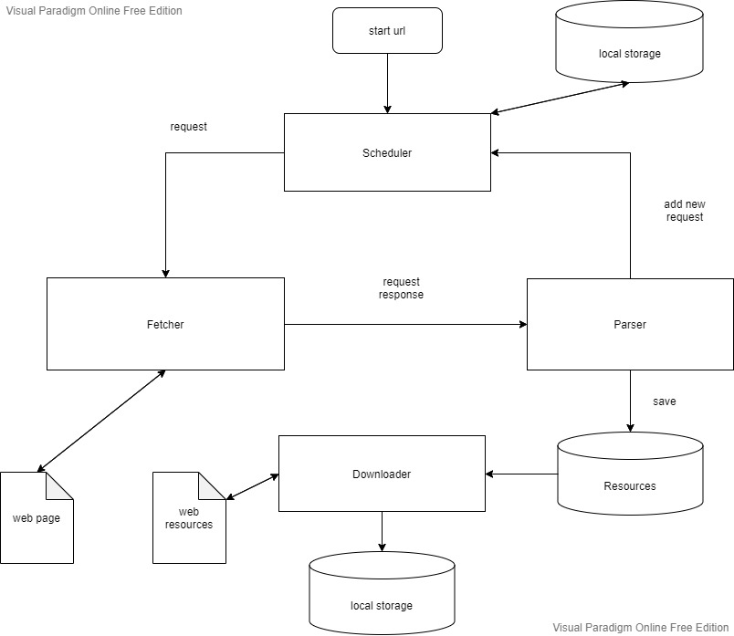
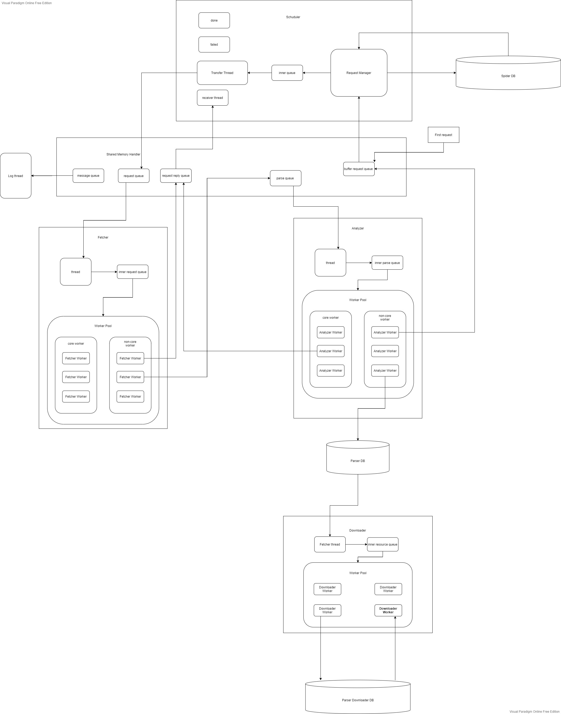

# NSpider

[README IN ENGLISH](README-en.md)

## 介绍
NymphSpider(NSpider) 是面向个人电脑的超轻量级资源爬取框架。nspider 基于requests库，采用多进程 + 多线程的设计。主要针对普通论坛、资源网站的图片、视频资源进行爬取。

nspider 基于 SQLite 进行数据和进度存储工作，在 nspider 设计框架和 SQLite 自有的鲁棒性上来看，你可以随时随地暂停，杀死nspider，nspider将会在下一次启动时自动恢复上一次的工作进度。

由于没有对本框架所有模块所有方法进行细致的测试，所以并不保证框架没有bug，还需要一些实践来验证本框架的鲁棒性。

## 抽象结构
如果你只是想使用该架构，只需了解如下结构即可。


## 真实结构
如果你想了解架构的真实结构，请看如下图。


## Requirements
* Python 3.6+
* Works on Linux(not sure), Windows, macOS(not sure)

## 安装
1. 复制 `nspider` 文件夹到你的项目目录，然后 `import nspider`。

2. 安装 nspider 到你的 python 环境
    ```python shell
    pip install nspider
    ```

## 快速上手

仅仅包含了最基础的用法，详细请见文档(编写中)。

假设你希望爬取这个帖子里所有的图片。

[冰冰壁纸、高清图片贴: https://tieba.baidu.com/p/7193897711](https://tieba.baidu.com/p/7193897711)

```python
import nspider

# 用于url拼接
base_url = 'https://tieba.baidu.com'

# 自定义 parser 类， 用于解析页面
# 小提示： 你可以自定义无限个不同的 parser 针对不同的页面然后套娃。
# 当你不使用自带 save 和 resource 方法保存资源和数据的时候注意考虑多线程编程的安全性。
class PageContentParser(nspider.Parser):
    
    # parser为必须实现的方法， request 参数为 nspider 中的自定义 request 类， response 为 requests 库的标准返回对象。
    def parse(self, request, response):
        # 用于返回值
        is_failed = False
        # 解析页面逻辑，随意编写，这里使用了 nspider 自带的一些方法
        # get_text_from_res 可以把 response 转为纯文本
        text = nspider.common.get_text_from_res(response)
        # 这里用了 nspider 简单封装的 selector 类，可以使用 xpath 或者 beautiful soup。
        selector = nspider.Selector(text)
        # 试图找到帖子的具体内容
        content = selector.soup.find("div", attrs={"class": "p_postlist"})
        if content:
            # 试图找到帖子里所有的图片
            imgs = content.find_all("img", attrs={"class": "BDE_Image"})
            if imgs:
                for img in imgs:
                    # 过滤掉广告图片
                    if img.get("ad-dom-img"):
                        pass
                    else:
                        # 如果你不想自己写逻辑，也不是想下载资源，只是想保存一些数据，你可以选择使用自带 save 方法把数据存储到对应的 parser 数据库。
                        # 参数必须为可以 pickle 的对象。完成爬取后你可以自己写代码访问 parser 对应数据库 中的 “parser_data” 表取出数据。
                        self.save(img.get("src"))
                        # 如果你只是想使用自带的功能下载资源，那就调用 resource 方法，同样把资源记录到数据库中。这个数据和上面的 save 保存的表不一样。
                        self.resource(img.get("src"), save_dir="./test-download", dupe_filter=True)
            # 试图找到该帖子的下一页
            next_page = selector.xpath('//li[contains(@class, "l_pager")]/a[text()="下一页"]/@href')
            if next_page:
                # 找到了下一页，加入新的请求，并指定该请求使用的解析器。
                self.request(base_url + next_page[0], parser_class=PageContentParser)
        # 如果 content 为 空 说明解析失败，意味着response 返回的东西并不是我们所预计的东西，
        # 有可能触发了百度的反爬机制，返回了一个验证页面。
        else:
            # 告诉框架该次 解析 失败
            is_failed = True
            self.logger.info("URL: {} parser failed".format(request.url))
        # 返回一个任意对象，以及是否解析成功
        return None, is_failed

# 定义一个 spider 类
# 指定初始 url 和 对应的 parser
class WangBingbingSpider(nspider.Spider):
    start_url = ["https://tieba.baidu.com/p/7193897711"]
    start_parser = [PageContentParser]


if __name__ == "__main__":
    # 初始化 spider， 然后开始爬取。
    # 查看控制台输出，当然你发现控制台长时间未有新动态的时候，爬虫基本上就已经结束了，你可以直接关闭或杀死爬虫。
    wbb_spider = WangBingbingSpider()
    wbb_spider.start()
    
    # 下面两行为下载命令，你可以把上面的spider命令注释掉，然后用下面的命令来下载刚才你用 resource 方法添加的资源文件。
    # tps 表示限定每秒最大并发数， thread_num 指定下载线程的数量。
    # downloader = nspider.Downloader(tps=5, thread_num=5) 
    # 你需要指定下载的是哪个 parser 添加的资源文件
    # downloader.start(PageContentParser)

```
考虑到网络，解析速度等原因，nspider并没有对是否完成所有爬取做判断，因此当控制台长时间未出现新信息时，基本可以判断爬取已经结束，你需要手动关闭 spider

当添加 request dupe_filter 为 True 时（默认为True）,你也可以尝试重新启动 nspdier 看看是否真的已经完成了所有请求。你应该只会看到 Refuse adding request 的信息。

现在你可以开始下载图片了。下载完毕后程序会自动退出。

如果中途退出，或者有些资源下载失败也不要紧，你可以多次运行该程序，默认配置会自动重新下载已经失败的，以及还没有下载的资源。

```python
if __name__ == "__main__":
    # 初始化 spider， 然后开始爬取。
    # 查看控制台输出，当然你发现控制台长时间未有新动态的时候，爬虫基本上就已经结束了，你可以直接关闭或杀死爬虫。
    # wbb_spider = WangBingbingSpider()
    # wbb_spider.start()

    # 下面两行为下载命令，你可以把上面的spider命令注释掉，然后用下面的命令来下载刚才你用 resource 方法添加的资源文件。
    # tps 表示限定每秒最大并发数， thread_num 指定下载线程的数量。
    downloader = nspider.Downloader(tps=5, thread_num=5)
    # 你需要指定下载的是哪个 parser 添加的资源文件
    downloader.start(PageContentParser)
```

关于如何下载一个吧里所有的图片请暂时查看 `demo/tieba` 下的文件作为参考

## 参考

参考、借鉴了 [Scrapy](https://github.com/scrapy/scrapy) 架构， 以及 [PSpider](https://github.com/xianhu/PSpider) 架构

## 文档

详细教程以及文档还在编写中。。。

## 许可证
[MIT](LICENSE) © Nymphxyz